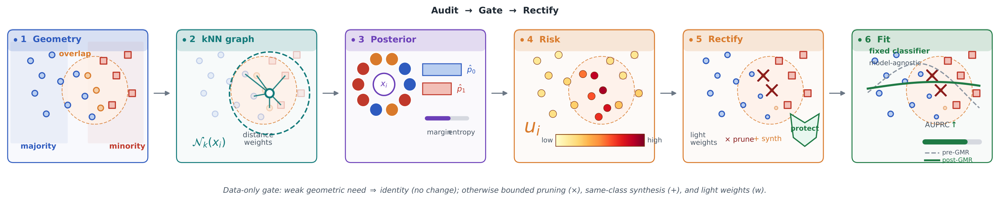
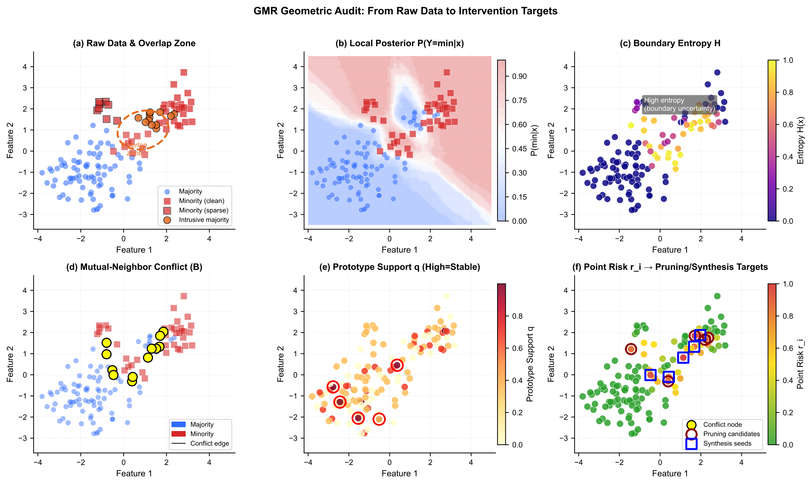
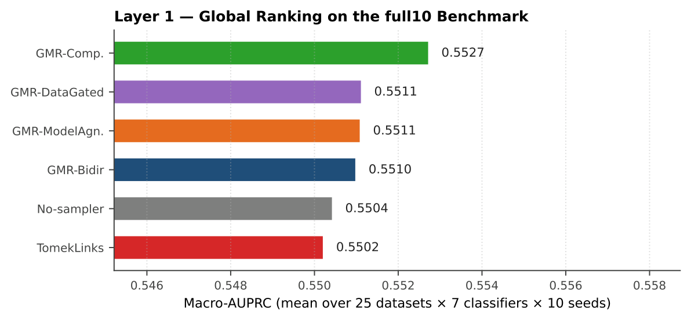
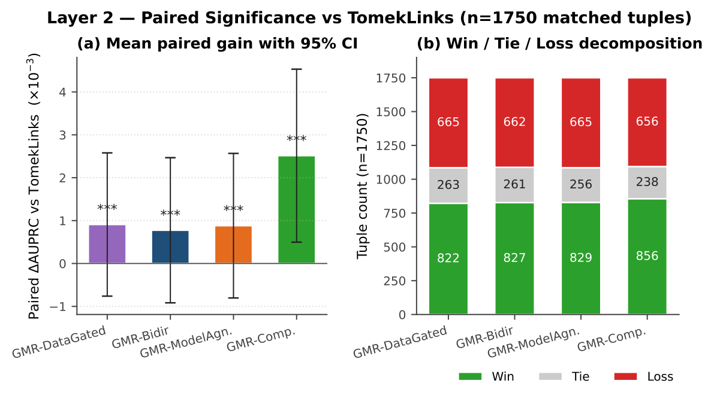
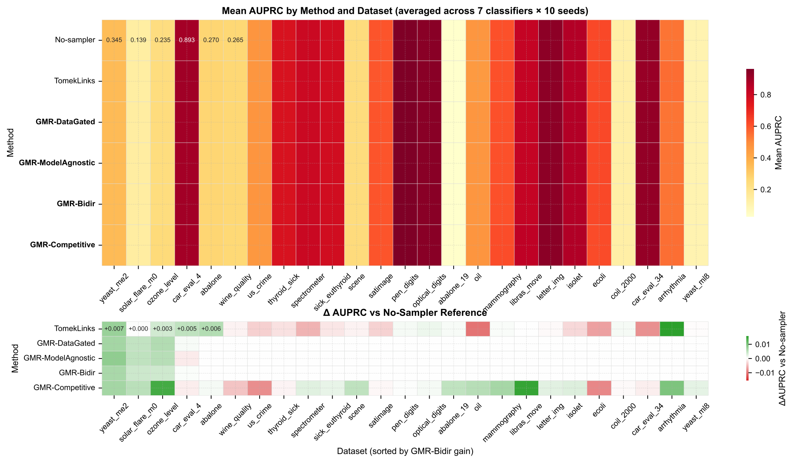
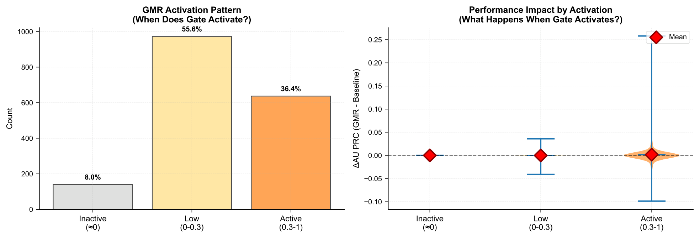
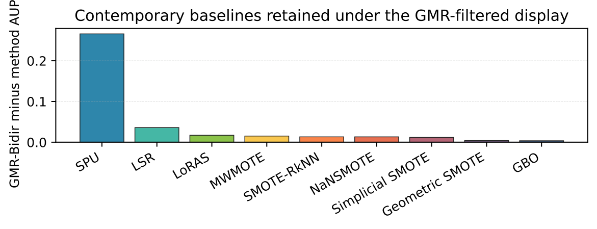
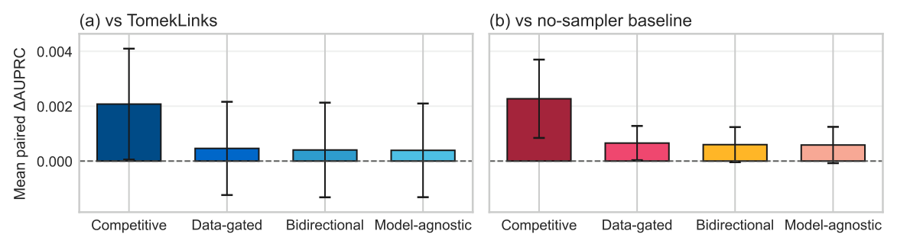
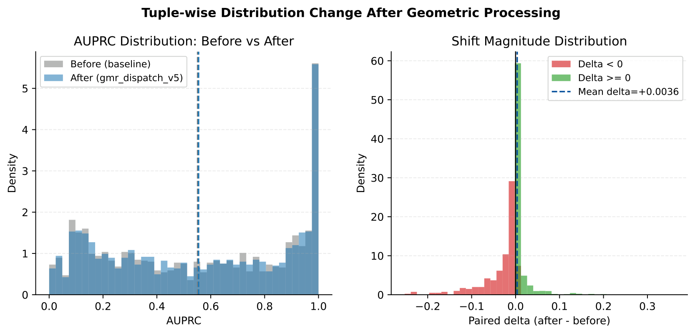

# Geometric Manifold Rectification (GMR)

<p align="center">
  
</p>

<p align="center">
  <a href="LICENSE"></a>
  <a href="https://www.python.org/downloads/"></a>
  
  
</p>

> **Geometric Manifold Rectification for Imbalanced Learning**  
> Xubin Wang · Qing Li (Fellow, IEEE) · Weijia Jia (Fellow, IEEE)  
> *Under Review*

---

**GMR** is a model-agnostic pre-training data-conditioning operator for imbalanced tabular classification. Unlike standard resamplers that apply unconditional transformations, GMR follows an **audit-then-rectify** principle:

1. **Audit** — estimates per-sample geometric reliability from inverse-distance local posteriors, neighborhood entropy, mutual-neighbor conflict, prototype support, and imbalance pressure.
2. **Gate** — decides whether any intervention is warranted. When local geometry is already healthy, GMR returns the **original training set bit-unchanged** (identity map).
3. **Rectify** — when the gate activates (~16 % of tuples), applies bounded majority-risk pruning + same-class synthesis under explicit per-class budgets and prior-shift caps.

The gate abstains on **84 % of dataset × classifier tuples**. All paired gains are fully auditable and concentrated on the geometric pathologies GMR is designed to correct.

---

## Contents

```text
gmr-imbalanced-learning/
├── code/
│   ├── gmr/
│   │   ├── rectifier.py        # GeometricManifoldRectifier / GMR
│   │   └── __init__.py         # Public API: GMR, GeometricManifoldRectifier
│   └── examples/
│       └── quick_start.py      # Minimal runnable example
├── data/
│   ├── benchmark_results_25datasets/       # 43 750-row matched-tuple artifact (25 ds · 7 clf · 10 seeds)
│   ├── contemporary_baselines_25datasets/  # 9-method contemporary comparison (15 750 rows)
│   └── synthetic_2d_experiments/          # 2 000-run synthetic 2-D benchmark (5 scenarios)
├── assets/                     # README figures (paper figs → PNG)
├── DATA_CARD.md
├── CITATION.cff
├── requirements.txt
└── setup.py
```

---

## Installation

```bash
git clone https://github.com/wangxb96/gmr-imbalanced-learning.git
cd gmr-imbalanced-learning
python3 -m venv .venv && source .venv/bin/activate
pip install --upgrade pip
pip install -r requirements.txt
pip install -e .
```

---

## Quick Start

```bash
python code/examples/quick_start.py
```

---

## Basic Usage

```python
from sklearn.ensemble import RandomForestClassifier
from sklearn.metrics import average_precision_score
from gmr import GMR

# drop-in imblearn-style interface
gmr = GMR(random_state=42)
X_clean, y_clean = gmr.fit_resample(X_train, y_train)

# inspect what the gate decided
print(gmr.audit_)
# identity (gate abstained):
#   {'activation': 0.11, 'geometric_need': 0.19, 'majority_removed': 0,
#    'synthetic_added': 0, 'profile': 'identity'}
#
# rectified (gate activated):
#   {'activation': 0.74, 'geometric_need': 0.68, 'overlap': 0.31,
#    'boundary_conflict': 0.24, 'minority_sparsity': 0.45,
#    'majority_removed': 5, 'synthetic_added': 12, 'profile': 'rectified'}

clf = RandomForestClassifier(class_weight="balanced", random_state=42)
clf.fit(X_clean, y_clean)
score = average_precision_score(y_test, clf.predict_proba(X_test)[:, 1])
print(f"AUPRC: {score:.4f}")
```

### scikit-learn Pipeline

```python
from sklearn.pipeline import Pipeline
from gmr import GMR

pipe = Pipeline([
    ("sampler", GMR(random_state=42)),
    ("clf",     RandomForestClassifier(class_weight="balanced", random_state=42)),
])
pipe.fit(X_train, y_train)
```

### The `audit_` Dictionary

After every `fit_resample` call, `gmr.audit_` contains:

| Key | Description |
|-----|-------------|
| `activation` | Gate activation score ∈ [0, 1] |
| `geometric_need` | Weighted aggregate of all geometric signals |
| `overlap` | Mean cross-class intrusion in local neighborhoods |
| `boundary_conflict` | Mean mutual-neighbor conflict rate |
| `minority_sparsity` | Minority cluster sparsity relative to majority |
| `majority_removed` | Boundary majority samples pruned |
| `synthetic_added` | Minority samples synthesised |
| `majority_synthetic_added` | Majority samples synthesised (bidirectional mode) |
| `profile` | `"identity"` / `"rectified"` / `"identity_budget_zero"` |

---

## Audit Components

<p align="center">
  
</p>

**(a)** Raw class overlap zone. **(b)** Local minority posterior P(Y=min | x). **(c)** Boundary entropy H. **(d)** Mutual-neighbor conflict (yellow = conflict node). **(e)** Prototype support q — low-support points become synthesis seeds. **(f)** Aggregated point risk r_i → pruning candidates (red circles) and synthesis seeds (blue squares).

---

## Key Results

### Global Ranking (25 datasets · 7 classifiers · 10 seeds)

<p align="center">
  
</p>

| Method | Macro-AUPRC | vs TomekLinks | Wilcoxon *p* | Cliff's δ |
|--------|:-----------:|:-------------:|:------------:|:---------:|
| No sampler | 0.5477 | −2.5×10⁻³ | — | — |
| TomekLinks (best non-GMR) | 0.5502 | ref. | — | — |
| **GMR-Bidirectional** *(principal)* | **0.5510** | **+7.7×10⁻⁴** | **2.5×10⁻⁴** | +0.041 |
| GMR-DataGated | 0.5511 | +9×10⁻⁴ | <10⁻³ | +0.041 |
| GMR-ModelAgnostic | 0.5511 | +9×10⁻⁴ | <10⁻³ | +0.041 |
| GMR-Competitive *(upper bound)* | **0.5527** | **+2.5×10⁻³** | **2.4×10⁻⁶** | **+0.114** |

All four GMR variants outperform TomekLinks and the no-sampler reference. The three strict variants cluster within ±7×10⁻⁴ AUPRC — consistent with their shared geometric core.

### Paired Significance

<p align="center">
  
</p>

### Per-Dataset Heatmap

<p align="center">
  
</p>

*Top: absolute AUPRC. Bottom: ΔAUPRC vs no-sampler. GMR-Bidirectional is consistent or superior across all 25 datasets.*

### Selective Gate Activation

<p align="center">
  
</p>

The gate activates on **16 % of tuples**. The remaining **84 %** are returned unchanged — all gains are concentrated in the geometrically pathological subset.

### Contemporary Baselines (2014–2025)

<p align="center">
  
</p>

Nine methods — `LSR`, `SimplicialSMOTE`, `SMOTERkNN`, `NaNSMOTE`, `GBO`, `GeometricSMOTE`, `LoRAS`, `MWMOTE`, `SPU` — evaluated under the same 1 750-tuple matched protocol. GMR-Bidirectional is the only method that never degrades against the no-sampler reference across all datasets and classifiers.

---

## Configuring the Four Paper Variants

All four paper variants use `GMR` (`GeometricManifoldRectifier`) with different intervention-strength parameters:

```python
from gmr import GMR

# Bidirectional — principal, recommended default
gmr_bidir = GMR(
    activation_threshold=0.62,
    max_majority_remove=0.006,
    max_synthetic_ratio=0.06,
    allow_bidirectional_synthesis=True,
    random_state=42,
)

# DataGated — stricter gate, stronger majority pruning
gmr_gate = GMR(
    activation_threshold=0.55,
    max_majority_remove=0.012,
    max_synthetic_ratio=0.06,
    allow_bidirectional_synthesis=False,
    random_state=42,
)

# ModelAgnostic — minimal intervention, no bidirectional synthesis
gmr_ma = GMR(
    activation_threshold=0.62,
    max_majority_remove=0.004,
    max_synthetic_ratio=0.04,
    allow_bidirectional_synthesis=False,
    random_state=42,
)

# Competitive — aggressive, upper-bound headroom
gmr_comp = GMR(
    activation_threshold=0.50,
    max_majority_remove=0.015,
    max_synthetic_ratio=0.10,
    allow_bidirectional_synthesis=True,
    random_state=42,
)
```

<p align="center">
  
</p>

| Variant | `activation_threshold` | `max_majority_remove` | `max_synthetic_ratio` | Bidirectional | Role |
|---------|:-----:|:-----:|:-----:|:---:|------|
| **Bidirectional** | 0.62 | 0.006 | 0.06 | ✓ | **Principal — recommended** |
| DataGated | 0.55 | 0.012 | 0.06 | ✗ | Gate-only, stronger pruning |
| ModelAgnostic | 0.62 | 0.004 | 0.04 | ✗ | Minimal intervention |
| Competitive | 0.50 | 0.015 | 0.10 | ✓ | Upper-bound headroom |

---

## Distribution Shift

<p align="center">
  
</p>

When the gate activates, GMR shifts the minority–majority ratio by at most 1 % (enforced via `max_prior_shift`). The histogram above shows the empirical prior-shift distribution across all activated tuples.

---

## Reproducing Benchmark Artifacts

All pre-computed derived CSVs are in `data/`. No re-running is required.

### 25-dataset real-world benchmark

```python
import pandas as pd

# 43 750 rows: 25 datasets × 7 classifiers × 10 seeds × (baseline + TomekLinks + 4 GMR variants)
df = pd.read_csv("data/benchmark_results_25datasets/full_results.csv")
print(df.groupby("method")["auprc"].mean().sort_values(ascending=False))
```

### Synthetic S1-S5 (revised generator)

The synthetic benchmark data in this repository is the revised S1-S5 suite (3,500 runs: 5 scenarios × 7 methods × 4 imbalance ratios × 5 seeds × 5 classifiers). The revised generator intentionally changes the geometry/noise strategy versus the earlier toy suite:

- S1: anisotropic overlap + asymmetric boundary flips
- S2: warped circles + radial jitter
- S3: rotated moons + heteroscedastic noise
- S4: minority bridge + clustered outliers
- S5: correlated 50-D with heteroscale nuisance dimensions

```python
df_syn = pd.read_csv("data/synthetic_2d_experiments/results_s1s5_revised_full.csv")
print(df_syn.groupby("method")["auprc"].mean().sort_values(ascending=False))
# GMR            0.6315
# TomekLinks     0.6256
# None           0.6167

summary = pd.read_csv("data/synthetic_2d_experiments/summary_s1s5_revised_by_scenario.csv")
print(summary.head())
```

### Contemporary baselines

```python
cont = pd.read_csv("data/contemporary_baselines_25datasets/contemporary_method_summary_vs_gmr.csv")
print(cont)
```

See [`DATA_CARD.md`](DATA_CARD.md) for the full data inventory and redistribution notes.

---

## Data Policy

This repository contains **derived benchmark CSVs only** — no raw third-party datasets are redistributed. See [`DATA_CARD.md`](DATA_CARD.md) for details.

---

## License

[MIT](LICENSE) — free to use, modify, and redistribute with attribution.

---

## Citation

```bibtex
@article{wang2026geometric,
  title   = {Geometric Manifold Rectification for Imbalanced Learning},
  author  = {Wang, Xubin and Li, Qing and Jia, Weijia},
  journal = {arXiv preprint arXiv:2602.13045},
  year    = {2026}
}
```

Paper link: [https://arxiv.org/pdf/2602.13045](https://arxiv.org/pdf/2602.13045)

For machine-readable citation metadata, see [`CITATION.cff`](CITATION.cff).
